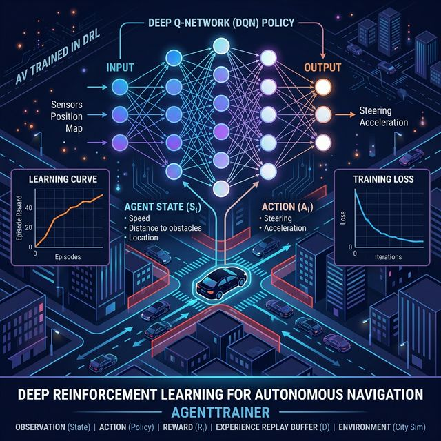

<div align="center">

# CarlaBEV-Lab 🧠🚀

**The Deep Reinforcement Learning Training Suite for CarlaBEV**

[](https://www.python.org/downloads/release/python-3120/)
[](https://stable-baselines3.readthedocs.io/)
[](https://pytorch.org/)
[](https://optuna.org/)

</div>

---

## 📌 Overview

**CarlaBEV-Lab** is the centralized experimental playground and training suite for the [CarlaBEV API](https://github.com/yourusername/carlabev-env). It is engineered for mass-scaling Deep Reinforcement Learning experiments for autonomous driving R&D. 

By natively combining **Stable Baselines3** with high-performance hyperparameter tuning by **Optuna**, CarlaBEV-Lab simplifies launching everything from single-node local debugging to massively parallelized multi-node searches on HPC resources.

<!-- Hero Banner Image Placeholder -->
<div align="center">
  
</div>

---

## ✨ Key Features

- 🧠 **Ready-to-run RL Models:** Instantly train models using Stable Baselines3 (`PPO`, `SAC`, etc.) directly on the CarlaBEV simulations.
- 🎛️ **Massive Parallel Tuning:** Integrates robust Optuna searches with an SQLite backend, utilizing `constant_liar` sampling and connection timeouts for conflict-free concurrent parameter optimization.
- 🖥️ **HPC Grid Search Ready:** Out-of-the-box support for generating Slurm Job Arrays to run immense GPU searches efficiently across massive computing clusters.
- 📊 **Rich Analysis & Visualization:** Instantly generate HTML visualizations (Parameter Importance, Parallel Coordinates, Optimization History) of any search.

---

## 🚀 Getting Started

### Prerequisites
CarlaBEV-Lab depends directly on `CarlaBEV` being locally accessible. Use [`uv`](https://github.com/astral-sh/uv) to securely resolve the `pyproject.toml` pointing to your local `carlabev-env` project directory.

### Installation

1. Ensure the `carlabev-env` repository exists locally alongside this project.
2. Initialize and sync the training environment:
    ```bash
    uv sync
    ```

### Base Training & Evaluation

To verify everything is working, you can manually execute an evaluation, debugging loop, or train a base agent.

```bash
uv run python eval.py
uv run python test.py
```

---

## 🔬 Optuna Hyperparameter Tuning

CarlaBEV-Lab is structured into continuous and categorical search phases. You can run tuning locally, or scale it up across several nodes.

### 1. Running Locally (Interactive)

Execute tuning phases sequentially from your terminal:

**Phase 1: Tune Continuous Hyperparameters**
```bash
uv run python -m src.tuning.optuna_tuner \
    --exp-id 26 \
    --phase 1 \
    --n-trials-phase-1 100 \
    --timesteps-phase-1 1000000 \
    --save-every-phase-1 25 \
    --eval-episodes 30 \
    --eval-final-episodes 100
```
*(Video and model saving is automatically disabled during Phase 1 to reduce IO overhead.)*

**Phase 2: Tune Categorical Hyperparameters**
```bash
uv run python -m src.tuning.optuna_tuner \
    --exp-id 26 \
    --phase 2 \
    --n-trials-phase-2 50 \
    --timesteps-phase-2 2000000 \
    --save-every-phase-2 25
```

### 2. Large Scale HPC Grids

To deploy robust searches (for example, across multiple GPU nodes), utilize the included Slurm launcher scripts.
```bash
# Example: Submit the Job Array for 10 concurrent nodes to solve Phase 1
sbatch scripts/slurm_phase1_launcher.sh
```
*(Logs for each concurrent node scale gracefully into `results/logs/phaseX_%A_%a.out`)*

### 3. Analysis and Visualization

Review tuning runs instantly:
```bash
uv run python -m src.tuning.optuna_analysis --exp-id 26 --top-k 5
```
This generates parameter curves, importance breakdowns, and history charts stored in `results/carlabev_optuna_26_plots/`.

---

## 🗺️ System Architecture

The project splits the Deep RL process cleanly from tuning logic:
- `src/agents/`: Definitions, policy constructors, and hyperparameter ingestion.
- `src/config/`: Configuration loaders that bridge the user CLI arguments to the SB3 training loops.
- `src/trainers/`: Main logic for initializing `CarlaBEV` environments, applying Gym Wrappers, and training via model checkpoints.
- `src/tuning/`: Contains the distributed Optuna optimizer logic (`optuna_tuner.py`), and visualization toolings (`optuna_analysis.py`).
- `scripts/`: Collection of Bash scripts for HPC massive slurm-launch grid scaling.

---

## 📄 License
Created for robust R&D internal purposes.
