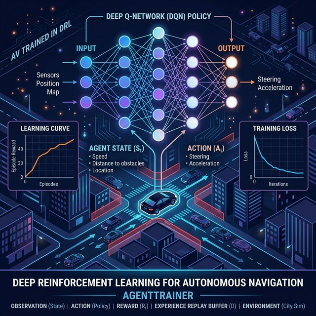

<div align="center">

# CarlaBEV-Lab 🧠🚀

**The Deep Reinforcement Learning Training Suite for CarlaBEV**

[](https://www.python.org/downloads/release/python-3120/)
[](https://stable-baselines3.readthedocs.io/)
[](https://pytorch.org/)
[](https://optuna.org/)

</div>

---

## 📌 Overview

**CarlaBEV-Lab** is the centralized experimental playground and training suite for the [CarlaBEV API](https://github.com/yourusername/carlabev-env). It is engineered for mass-scaling Deep Reinforcement Learning experiments for autonomous driving R&D. 

By natively combining **Stable Baselines3** with high-performance hyperparameter tuning by **Optuna**, CarlaBEV-Lab supports a study-driven workflow for local training, evaluation, and iterative search.

<!-- Hero Banner Image Placeholder -->
<div align="center">
  
</div>

---

## ✨ Key Features

- 🧠 **Study-driven PPO training:** Train and evaluate the maintained PPO navigation and scenario studies directly on CarlaBEV simulations.
- 🎛️ **Massive Parallel Tuning:** Integrates robust Optuna searches with an SQLite backend, utilizing `constant_liar` sampling and connection timeouts for conflict-free concurrent parameter optimization.
- 🧪 **Study-owned tuning stages:** Optuna search is declared per study with explicit tuning stages such as policy dynamics, rollout geometry, and loss regularization.
- 📊 **Rich Analysis & Visualization:** Instantly generate HTML visualizations (Parameter Importance, Parallel Coordinates, Optimization History) of any search.

---

## 🚀 Getting Started

### Prerequisites
CarlaBEV-Lab installs `CarlaBEV` from the GitHub source pinned in `pyproject.toml`, so local machine paths are no longer part of setup.

### Installation

1. Initialize and sync the training environment:
    ```bash
    uv sync
    ```

Right now the lab tracks the `main` branch of `carlabev-env`. Once you create a release tag such as `v0.1.0`, switch `[tool.uv.sources].CarlaBEV` from `branch = "main"` to `tag = "v0.1.0"` and run `uv sync` again for a reproducible pinned release.

### Base Training & Evaluation

To verify everything is working, you can manually execute an evaluation, debugging loop, or train a base agent.

### CLI Entry Point

The packaged CLI is now the primary way to interact with the lab:

```bash
uv run drl --help
```

After `uv sync`, the installed entry point also lives at `.venv/bin/drl`, so you
can run it directly once the virtualenv is activated or `.venv/bin` is on your
`PATH`.

The main command groups are:

- `train`: run one configured study experiment
- `eval`: evaluate the latest run for a configured study experiment
- `tune`: launch or analyze Optuna tuning stages
- `results`: inspect leaderboards, plots, and report assets
- `db`: inspect or clean Optuna state
- `diagnostics`: run seed-scene and pruning diagnostics
- `world-model`: collect and inspect offline datasets for the LeWM proof of concept

`drl` is the primary installed command.

### Git Hooks

This repo uses `pre-commit` to run local quality checks.

Install the hooks once per clone:

```bash
./tools/setup-hooks.sh
```

Hook behavior:

- `pre-commit`: `ruff --fix` and `ruff-format`
- `pre-push`: `ruff --fix` and `ruff-format`
- `pre-push`: `uv run pytest`


```bash
uv run drl train exp --study-id PPO_NAVIGATION --exp-id 26
uv run drl eval exp --study-id PPO_NAVIGATION --exp-id 26
uv run pytest
```

### World Model / LeWM Data Collection

The repo now includes a world-model dataset pipeline intended for a fast
LeWorld Model style proof of concept against the maintained PPO baseline.

The collector stores reusable offline datasets under:

```text
datasets/world_model/<dataset_name>/<study_id>/exp_<exp_id>/<split>/seed_<seed>/
```

Each shard stores transition-level arrays such as:

- `obs`
- `actions`
- `rewards`
- `dones`
- `next_obs`
- `route_signature`
- `scene_signature`
- `straight_fraction`
- `left_turn_fraction`
- `right_turn_fraction`

Collect a random-policy dataset:

```bash
uv run drl world-model collect exp \
  --study-id PPO_NAVIGATION \
  --exp-id 26 \
  --seed 0 \
  --num-envs 14 \
  --total-transitions 100000 \
  --steps-per-shard 4096 \
  --policy random \
  --dataset-name lewm-random-100k \
  --split train \
  --device cpu
```

Collect a PPO-policy dataset from the latest matching run:

```bash
uv run drl world-model collect exp \
  --study-id PPO_NAVIGATION \
  --exp-id 26 \
  --seed 0 \
  --num-envs 14 \
  --total-transitions 100000 \
  --steps-per-shard 4096 \
  --policy ppo \
  --dataset-name lewm-ppo-100k \
  --split train \
  --device cpu
```

For `--policy ppo`, the collector resolves the latest matching checkpoint from
the experiment's `LATEST_RUN.json` when `--checkpoint-path` is omitted.

Before collection starts, the collector validates that the checkpoint is
compatible with the requested dataset configuration. The checks include:

- `study_id`
- `exp_id`
- `algorithm`
- observation mode and semantic layout
- temporal fusion mode and frame stack
- action mode and action profile
- FOV settings
- live observation shape and action-space type

If the checkpoint contract does not match the requested dataset environment, the
collector fails fast instead of silently producing inconsistent PPO rollouts.

Inspect one shard:

```bash
uv run drl world-model inspect \
  --path datasets/world_model/lewm-random-100k/PPO_NAVIGATION/exp_26/train/seed_0
```

Summarize whole-dataset quality:

```bash
uv run drl world-model summary \
  --path datasets/world_model/lewm-random-100k/PPO_NAVIGATION/exp_26/train/seed_0
```

The summary command reports:

- total episodes and transitions
- action histogram
- episode-level route and scene uniqueness
- transition-level route and scene concentration
- mean reward
- done and terminated rates
- mean straight / left / right route fractions

### Testing

The repo ships with a `pytest` suite focused on the maintained PPO path.

Run the full suite:

```bash
uv run pytest
```

Run a focused subset:

```bash
uv run pytest tests/config
uv run pytest tests/factories tests/agents
uv run pytest -m integration
```

Current test coverage is organized as:

- `tests/config/`: study schema, experiment loading, reset protocol sampling, and run-path generation
- `tests/factories/`: PPO-only factory dispatch and unsupported-algorithm rejection
- `tests/agents/`: CNN PPO backbone, discrete head, and continuous head behavior
- `tests/eval/`: evaluation aggregation and study scoring
- `tests/trainers/`: PPO smoke coverage with fake vector environments
- `tests/tuning/`: Optuna phase mutation and orchestration behavior

Markers declared in `pyproject.toml`:

- `unit`: fast isolated tests
- `integration`: multi-module local integration tests
- `slow`: heavier smoke coverage
- `envdep`: tests that rely on the CarlaBEV runtime contract

### Configuration Contract

CarlaBEV-Lab now uses CarlaBEV's public config contract internally. The canonical environment fields are:

- `map_name`
- `obs_mode` (`bev_rgb`, `bev_semantic`, `vector`)
- `action_mode` (`discrete`, `continuous`)
- `reward_mode` (`shaping`, `carl`)

For the current study path, the preferred declarative selectors are the profile IDs exported by `carlabev-env`:

- `difficulty_id`
- `action_profile_id`
- `reward_profile_id`

Legacy aliases such as `obs_space`, `action_space`, and `reward_type` are still accepted for compatibility, but they emit deprecation warnings and are intended only as migration shims at older config boundaries.

### Study Registry

Experiments are now organized under named studies instead of one global mutable experiment table.

- A study contains metadata, its Optuna study name, its SQLite database path, train/eval protocol registries, and a dictionary of `exp_id -> ExperimentSpec`.
- Study definitions live in separate modules under `src/config/studies/`.
- Registry and lookup helpers live in `src/config/studies/registry.py`.
- `PPO_NAVIGATION` is the default migrated navigation study and currently contains 31 experiment variants.
- `EDGE_CASE_SCENARIOS` is a second study for curated hazardous scenarios such as `jaywalk`, `lead_brake`, and `red_light_runner`.
- Authored edge-case scenes are copied locally under `assets/scenes/` and grouped by family through `src/config/authored_scenarios.py`.
- Authored-scene variation behavior is declared in the study protocol specs, not hardcoded in trainers:
  - edge-case train protocols use randomized authored variants
  - edge-case eval protocols use the same authored scenes with variation disabled

Each experiment now references:

- one `train_protocol_id`
- one or more `eval_protocol_ids`

That lets a study train on one distribution and evaluate on another.

Current examples:

- `PPO_NAVIGATION`: trains on random generated navigation scenes and evaluates on random generated navigation scenes
- `EDGE_CASE_SCENARIOS`:
  - `exp-id 1`: train on all authored `jaywalk-*` scenes, evaluate on all authored edge-case scenes
  - `exp-id 2`: train on all authored `leadbrake-*` scenes, evaluate on all authored edge-case scenes
  - `exp-id 3`: train on all authored `redlightrunner-*` scenes, evaluate on all authored edge-case scenes
  - `exp-id 4`: train on all authored edge-case scenes, evaluate on all authored edge-case scenes

For authored-scene studies, the reset protocol can also declare:

- `variation_enabled`
- `variation_seed_mode`
- `variation_seed`
- `variation_seed_min`
- `variation_seed_max`

This allows train/eval variation policy to remain fully declarative.

### Reset Seed Scheduling

The active PPO path now separates:

- run seed: experiment identity and reproducibility anchor
- reset seed schedule: episode-to-episode and env-slot diversity

For `random_navigation` protocols, the reset sampler derives deterministic
per-env, per-episode seeds from the top-level run seed and protocol id.

Current modes:

- `fixed`: each env slot reuses its own fixed reset seed across episodes
- `incremental`: each env slot advances a deterministic counter-based seed
- `hashed_episode`: each env slot gets a hashed `(run_seed, protocol_id, env_slot, reset_count)` seed

The default navigation setting is `hashed_episode`.

Practical consequences:

- parallel env slots no longer collapse onto the same reset seed
- episode diversity is maintained inside a run
- rerunning with the same top-level run seed reproduces the same reset-seed schedule

Study-level seed policy:

- Optuna phases and the main study launchers now use the shared 10-prime seed set
- `2, 3, 5, 7, 11, 13, 17, 19, 23, 29`
- this keeps study comparisons aligned across trials, studies, and manual sweeps

Current limitation:

- `scenario_catalog` protocols still build one shared reset options payload per
  vector reset call, so authored-scene entry choice is not yet independently
  diversified per env slot in the same reset wave
- this does not affect the random-navigation seed pathology fix

### Manual Runs vs Optuna

A normal training command such as:

```bash
uv run drl train exp --study-id EDGE_CASE_SCENARIOS --exp-id 1
```

is still recorded through Optuna. It is treated as a single fixed trial using the current config values for that experiment.

Use this when you want:

- one baseline run
- one reproduced run with fixed parameters
- one study/experiment run logged into the same Optuna database

Use `uv run drl tune run` when you want actual hyperparameter search across many trials.

Typical workflow:

```bash
uv run drl train exp --study-id PPO_NAVIGATION --exp-id 26
uv run drl eval exp --study-id PPO_NAVIGATION --exp-id 26
uv run drl train exp --study-id EDGE_CASE_SCENARIOS --exp-id 1
uv run drl train exp --study-id EDGE_CASE_SCENARIOS --exp-id 4
```

### Evaluation Metrics And Study Scoring

Evaluation payloads now include comfort-aware metrics in addition to task success:

- `success_rate`
- `collision_rate`
- `unfinished_rate`
- `mean_abs_accel_long`
- `mean_abs_accel_lat`
- `mean_abs_jerk_long`
- `mean_abs_jerk_lat`
- `mean_abs_yaw_rate`
- `mean_abs_yaw_acc`
- `comfort_violation_rate`
- `harsh_brake_rate`
- `comfort_score`
- `normalized_score`

`normalized_score` is the main bounded study-ranking score. It is designed to stay interpretable across reward changes by combining:

- task completion
- collision avoidance
- unfinished episodes
- comfort

Raw `mean_return` is still logged and saved, but it is no longer the preferred leaderboard metric for study comparisons.

### Result Inspection

Print raw completed trials for a study:

```bash
uv run drl results top-trials \
  --study-id PPO_NAVIGATION_DIFFICULTY \
  --top-k 10
```

Print seed-averaged experiment summaries:

```bash
uv run drl results top-experiments \
  --study-id PPO_NAVIGATION_MEDIUM_TEMPORAL_FUSION \
  --top-k 3
```

Print the normalized-score leaderboard:

```bash
uv run drl results leaderboard \
  --study-id PPO_NAVIGATION_MEDIUM_SEMANTIC_CLASSES \
  --top-k 6
```

### Seed Scene Diagnostics

The seed-scene diagnostic tooling is now split into two stages so you do not need to rerun the simulator every time you tweak the figures.

Run the expensive data-generation pass once:

```bash
uv run drl diagnostics seed-scenes analyze \
  --difficulty-ids rt_medium_v1 \
  --samples-per-seed 1000 \
  --seed-mode incremental \
  --save-frames-per-pair 6 \
  --output-dir results/seed_scene_diag_medium_incremental
```

This writes reusable artifacts for each `(difficulty, seed)` pair:

```text
results/seed_scene_diag_medium_incremental/
  summary.json
  all_samples.csv
  <difficulty_id>/
    seed_<seed>/
      samples.csv
      spawn_points.csv
      route_points.csv
      frames/
```

Re-render figures from those saved artifacts without touching the simulator:

```bash
uv run drl diagnostics seed-scenes visualize \
  --output-dir results/seed_scene_diag_medium_incremental
```

Spawn clustering is visualization-only and can be tuned without rerunning analysis:

```bash
uv run drl diagnostics seed-scenes visualize \
  --output-dir results/seed_scene_diag_medium_incremental \
  --spawn-cluster-radius 20 \
  --spawn-top-k 10
```

Behavior of the current plots:

- `spawn_*`: top repeated spawn zones shown as numbered cluster centroids
- `route_*`: route corridor density heatmaps
- default spawn clustering merges nearby starts within a `16`-pixel radius and shows the top `10` clusters

If you still want the original one-command workflow, the script defaults to `full` mode when no subcommand is provided.

Interpretation after the seed fix:

- `fixed` is the old collapse mode and is useful as a control
- `incremental` and the lab runtime `hashed_episode` mode are the diversity-preserving settings

### Run Artifact Layout

Study runs now use a short, structured scaffold instead of long descriptive folder names:

```text
runs/
  <study_id>/
    exp_<exp_id>/
      trial_<trial_id>|trial_manual/
        seed_<seed>/
          config.yaml
          train.log
          status.json
          checkpoints/
          eval/
          videos/
```

Two identifiers are tracked in config and status files:

- `run_label`: `{study_id}_e{exp_id}`
- `run_id`: `{study_id}_e{exp_id}_t{trial_id}_s{seed}`

The latest resolved run for each `(study_id, exp_id)` is also written to:

```text
runs/<study_id>/exp_<exp_id>/LATEST_RUN.json
```

### Repository Layout

The repo root is intentionally kept narrow:

- `src/`: maintained Python package code and CLI modules
- `infra/slurm/`: cluster launchers for study sweeps
- `tools/`: local repo helpers such as hook installation
- `docs/`: generated figures and authored notes
- `assets/`: curated static scene inputs and images

### Video Capture Policy

The study launchers now use explicit milestone-based capture:

- training:
  - `20` probe videos across a `1_000_000`-step run
- intermediate evaluation:
  - `5` videos sampled across the `100` eval episodes
- final evaluation:
  - `10` videos sampled across the `1000` final episodes

All video outputs live under the run-local `videos/` tree:

```text
videos/
  train/
  eval/
    intermediate/
    final/
```

---

## 🔬 Optuna Hyperparameter Tuning

CarlaBEV-Lab now declares tuning through the study system. Each study can own an explicit sequence of tuning stages instead of opaque phase numbers.

### 1. Running Locally (Interactive)

Execute tuning stages sequentially from your terminal:

**Policy Dynamics: tune learning rate, GAE lambda, and discount factor**
```bash
uv run drl tune run \
    --study-id PPO_NAVIGATION \
    --exp-id 26 \
    --stage policy_dynamics \
    --n-trials 100 \
    --total-timesteps 1000000 \
    --eval-episodes 30 \
    --eval-final-episodes 100
```
*(Video and model saving are disabled during tuning stages by the study-owned tuning config.)*

**Rollout Geometry: tune rollout horizon and minibatch/update geometry**
```bash
uv run drl tune run \
    --study-id PPO_NAVIGATION \
    --exp-id 26 \
    --stage rollout_geometry \
    --n-trials 50 \
    --total-timesteps 2000000
```

The current `PPO_NAVIGATION` study declares these stages:

- `policy_dynamics`
- `rollout_geometry`
- `loss_regularization`
- `network_capacity`

### 2. Analysis and Visualization

Review tuning runs instantly:
```bash
uv run drl tune analyze --study-id PPO_NAVIGATION --exp-id 26 --top-k 5
```
This loads the Optuna study configured for `PPO_NAVIGATION`, filters to experiment `26`, and generates parameter curves, importance breakdowns, and history charts under `results/`.

---

## 🗺️ System Architecture

The project splits the PPO training flow cleanly from tuning logic:
- `src/agents/`: PPO policy and backbone constructors used by the maintained study path.
- `src/config/`: Study registry, typed experiment definitions, and configuration loaders that bridge CLI arguments to CarlaBEV run configs.
- `src/config/reset_protocol.py`: Shared train/eval reset samplers built from study protocol definitions.
- `src/trainers/`: PPO training loop and checkpoint/evaluation orchestration.
- `src/eval/`: PPO evaluation, protocol aggregation, and study scoring.
- `src/tuning/`: Distributed Optuna orchestration (`optuna_tuner.py`) and analysis tooling (`optuna_analysis.py`).
- `src/carlabev_lab/`: package-backed CLI commands for reporting, diagnostics, and DB maintenance.
- `infra/slurm/`: cluster launchers for study sweeps.
- `tools/`: local repository helpers such as hook installation.

---

## 📄 License
Created for robust R&D internal purposes.
